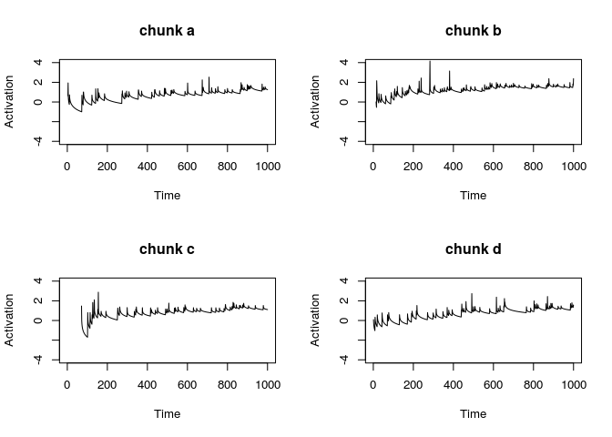
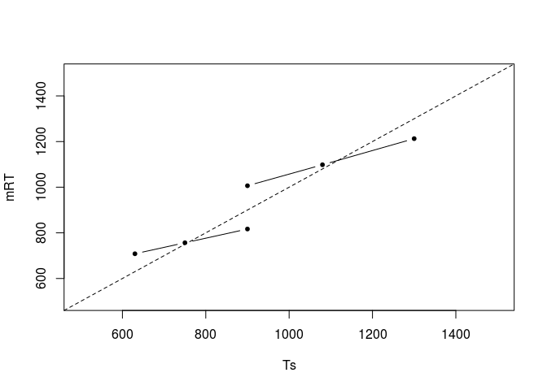
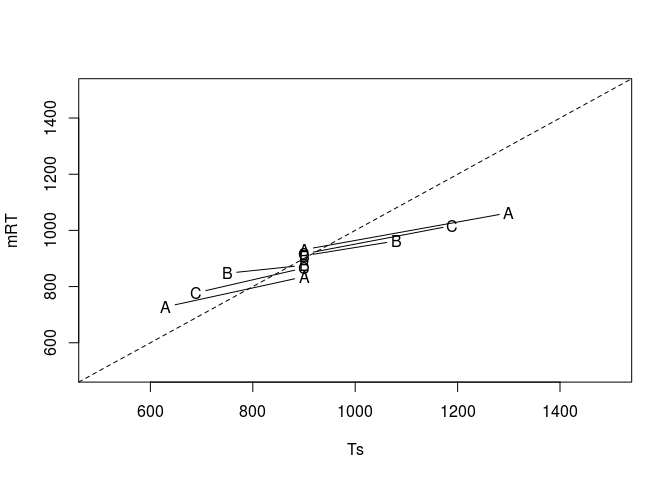

Cognitive Model of Human interval timing
================
Ko Kleppe
October, 2018

``` r
### Ko Kleppe 1910833 Final assignment ####
## Cogntive modeling: Basic principles and methods. 
## 2018 ##
setwd("~/Documenten/Study/HMC 2017-2018/1B/Cogntive Modeling Basic Principles and Methods")
source("DM-module.r")
```

    ## Activation of chunk  a  is 1.251998 
    ## Activation of chunk  b  is 2.371303 
    ## Activation of chunk  c  is 1.110016 
    ## Activation of chunk  d  is 1.482546

``` r
library(ggplot2)
```



``` r
library(data.table)

## DM properties.
params$num.chunks <- 36
params$max.num.encounters <- 500
params$duration <- 1000
params$noise <- 0.2

# Setting experiment.

num_trials <- 90

# Determining range conditions.
short <- c(630, 750, 900)
long <- c(900, 1080, 1300)

# Version A.
short_A <- c(630, 630, 900)
long_A <- c(900, 1300, 1300)

# Version B.
short_B <- c(750, 750, 900)
long_B <- c(900, 1080, 1080)

# Version C.
short_C <- c(690, 690, 900)
long_C <- c(900, 1190, 1190)

# Block 1. 
Version <- c("A","B","C")
Conditions <- c("short","long")

# Random number function.
random_number <- function(block, condition, version) {
  
  if (block == 1) {
    if (condition == "short") {
      x <- sample(short,1)
    } else if (condition == "long") {
      x <- sample(long,1)
    }
  } else {
    if (version == 1 && condition == "short") {
      x <- sample(short_A,1)  
    } else if (version == 1 && condition == "long") {
      x <- sample(long_A,1)
    } else if (version == 2 && condition == "short") {
      x <- sample(short_B,1)
    } else if (version == 2 && condition == "long") {
      x <- sample(long_B,1)
    } else if (version == 3 && condition == "short") {
      x <- sample(short_C,1)
    } else if (version == 3 && condition == "long") {
      x <- sample(long_C,1)
    }
  }
  return (x)
}

# Noise function. 
actr.noise <- function(s,n=1) {
  rand <- runif(n,min=0.0001,max=0.9999)
  s * log((1 - rand ) / rand)
}

# Converts pulses to time.
pulse_to_time <- function(pulse, t0 = 11, a = 1.1, b = 0.015) {
  time_sum <- t0
  x <- 0
  while (x < pulse) {
    time <- a * t0 + actr.noise(s= b * a * t0)
    time_sum <- time_sum + time
    t0 <- time
    x <- x + 1
  }
  return(time_sum)
}

# Converts time to pulses.
time_to_pulse <- function(time, t0 = 11, a = 1.1, b = 0.015) {
  
  total_time <- t0
  t <- t0
  pulse <- 0
  while(total_time < time) {
    tn <- a * t + actr.noise(s= b * a * t)
    total_time <- total_time + tn
    t <- tn
    pulse <- pulse + 1
  }
  
  # Substracting one pulse because the total time (t-1) is closer to the actual time.
  return(pulse-1)
}

# Trial function which runs a specific condition and version.
trial <- function(participant, time, block, condition, version) {
  df <- data.frame(Time <- numeric(0), Subj<-numeric(0), Cond<-numeric(0), Ts<-numeric(0), Tp<-numeric(0), Block <- numeric(0), Version <- numeric(0))

  for (Trial in 1:num_trials) {
    
      # Fixation 1.
      time <- time + runif(1,1.5,2)
      Ts <- (random_number(block, Conditions[condition], version))
      T2p <- (time_to_pulse(Ts))
      time <- time + (Ts/1000)
      DM <<- add.encounter(DM, T2p, time)   
      # Fixation 2.
      time <- time + runif(1,1.5,2)
      blend <- blend(time, Ts)
      Tp <- pulse_to_time(blend(time, Ts))
      time <- time + (Tp/1000)
    
      # Fixation 3.   
      time <- time + runif(1,2,3)
      df <-rbind(df, c(time, participant, condition, block, Trial, Ts, Tp, version))
    } 
  colnames(df)<-c("Time","Subj", "Condition","Block", "Trial","Ts", "Tp", "Version")
  return(df)
}

## Experiment for twenty-six participants.
# DM is reset for every participant.
experiment <-function() {
  df1 <-data.frame(Time <- numeric(0), Subj<-numeric(0), Cond<-numeric(0), Ts<-numeric(0), Tp<-numeric(0), Block <- numeric(0), Version <- numeric(0))
  
      for (participant in 1:26) {
        # Create a DM with room for num.chunks chunks with up to num.encounters encounters per chunk.
        DM <<- create.dm(params$num.chunks, params$max.num.encounters)
        time <- 0
        
        if (participant < 9 ) {
          version = 1
        } else if (participant > 9 && participant < 18 ) {
          version = 2
        } else if (participant > 18) {
          version = 3
        }
        
        for (block in 1:2) {
          if (block == 1) {
            if (participant %% 2 != 0) {
                condition = 1
            } else {
              condition = 2
            }
          } else if (block == 2) {
            if (participant %% 2 == 0) {
              condition = 1
            } else {
              condition = 2
            }
          }
       
            data_trial <- trial(participant, time, block, condition, version)
            # Saving the last time value of the first block.
            time <- data_trial$Time[length(data_trial$Time)]
            df1 <- rbind(df1, data_trial)
        }
      }
    
  return(df1)
}

# Blend function.
blend <- function(time, Ts) {
  sum_blend <- 0
  
  # Arrays which are initially filled with zeros.
  activation <- array(rep(0,params$num.chunks))
  probability <- array(rep(0,params$num.chunks))
  blend <- array(rep(0,params$num.chunks))
  
  # Loop that goes through all the chunks and stores activation per chunk.
  for (chunk in 1:params$num.chunks) {
    if (!is.na(DM[chunk])) {
          activation[chunk] <- exp((actr.B(get.encounters(DM, chunk),time))/params$noise)
    }
  }
  
  # Calculate probability per chunk and multiply this probability with chunk number.
  for (chunk in 1:params$num.chunks) {
    if (!is.na(DM[chunk])) {
      probability[chunk] <- exp(actr.B(get.encounters(DM, chunk),time)/params$noise)/sum(activation, na.rm = TRUE)
      blend[chunk] <- probability[chunk] * chunk
    }
   
  }
  
 # Return the sum of the blend function.
 sum_blend <- sum(blend, na.rm = TRUE)
 return (sum_blend)
}

df1 <- experiment() 

# Relabel numerics.
df1$Condition = factor(df1$Condition, levels = c(1,2) ,labels=c("short","long"))
df1$Version = factor(df1$Version, levels = c(1,2,3), labels = c("A","B","C"))

# Convert Dataframe to Datatable.  
df1 <- as.data.table(df1)
```

``` r
### Plotting.
  
# Create means per participant.
plotdat <- df1[Tp>250 & Tp<1750,list(mRT=mean(Tp),nRT=length(Tp),sdRT=sd(Tp)),by=list(Ts, Block, Version,Condition, Subj)]

# Create overall means:
plotdat <- plotdat[,list(mRT=mean(mRT),sdRT=sd(mRT)),by=list(Ts,Block,Version,Condition)]
plotdatBlock1 <- plotdat[Block==1,list(mRT=mean(mRT),sdRT=sd(mRT)),by=list(Ts, Block, Condition)]

# Plotting block one.
setkey(plotdatBlock1,Ts)
plotdatBlock1[Condition =="short",plot(Ts,mRT,type="b",pch=20,xlim=c(500,1500),ylim=c(500,1500))]
```

    ## NULL

``` r
plotdatBlock1[Condition =="long",lines(Ts,mRT,type="b",pch=20,xlim=c(500,1500),ylim=c(500,1500))]
```

    ## NULL

``` r
abline(a=0,b=1,lty=2)
```



``` r
# Plotting block two.
plotdatBlock2 <- plotdat[Block==2,]
setkey(plotdatBlock2, Ts)
plotdat_A <- plotdatBlock2[Version == "A", list(mRT=mean(mRT),sdRT=sd(mRT)) ,by=list(Ts,Block,Version,Condition)]
plotdat_A[Condition == "short",plot(Ts,mRT,type="b",pch='A',xlim=c(500,1500),ylim=c(500,1500))]
```

    ## NULL

``` r
plotdat_A[Condition == "long",lines(Ts,mRT,type="b",pch='A',xlim=c(500,1500),ylim=c(500,1500))]
```

    ## NULL

``` r
abline(a=0,b=1,lty=2)

for (Vers in c("B","C")) {
  for (Cond in c("short","long")) {
    plotdatBlock2[Version==Vers & Condition==Cond,
                  lines(Ts,mRT,type="b",pch=Vers)]
  }
}
```



``` r
# Analyzing trial-by-trial effects.
library(lme4)
```

    ## Loading required package: Matrix

``` r
library(lmerTest)
```

    ## 
    ## Attaching package: 'lmerTest'

    ## The following object is masked from 'package:lme4':
    ## 
    ##     lmer

    ## The following object is masked from 'package:stats':
    ## 
    ##     step

``` r
# Creating a dataframe for the regression analysis.
anadat <- df1[Block==1 & Tp > 250 & Tp < 1750,]
anadat[,cRT := 0]
anadat[Condition=="short",cRT := Tp - mean(Tp)]
anadat[Condition=="long",cRT := Tp- mean(Tp)]
anadat[,relDur:=0]
anadat[Ts==630,relDur:=-1]
anadat[Ts==900 & Condition=="short",relDur:=1]
anadat[Ts==900 & Condition=="long",relDur:=-1]
anadat[Ts==1300,relDur:=1]
anadat[,cLen:= ifelse(Condition=="long",.5,-.5),]
anadat$blockTrial <- as.numeric(anadat$blockTrial)

# Prev Trial RT:
tmp <- anadat[,list(p_cRT=c(NA,cRT[1:(length(cRT)-1)]),Trial=Trial),by=Subj]
anadat <- merge(anadat,tmp,by=c("Subj","Trial"))

# Prev Prev Trial RT:
tmp <- anadat[,list(p2_cRT=c(NA,NA,cRT[1:(length(cRT)-2)]),Trial=Trial),by=Subj]
anadat <- merge(anadat,tmp,by=c("Subj","Trial"))

# Prev Trial RelDur:
tmp <- anadat[,list(p_relDur=c(NA,relDur[1:(length(relDur)-1)]),Trial=Trial),by=Subj]
anadat <- merge(anadat,tmp,by=c("Subj","Trial"))

# Regression formula used for analysis.
lme3 <- lmer(cRT ~ relDur * cLen + p_cRT + p2_cRT + p_relDur + (1 | Subj), anadat)
summary(lme3)
```

    ## Linear mixed model fit by REML t-tests use Satterthwaite approximations
    ##   to degrees of freedom [lmerMod]
    ## Formula: cRT ~ relDur * cLen + p_cRT + p2_cRT + p_relDur + (1 | Subj)
    ##    Data: anadat
    ## 
    ## REML criterion at convergence: 28116.8
    ## 
    ## Scaled residuals: 
    ##     Min      1Q  Median      3Q     Max 
    ## -3.0724 -0.6306 -0.0709  0.5726  5.9093 
    ## 
    ## Random effects:
    ##  Groups   Name        Variance Std.Dev.
    ##  Subj     (Intercept)   101.6   10.08  
    ##  Residual             12811.0  113.19  
    ## Number of obs: 2287, groups:  Subj, 26
    ## 
    ## Fixed effects:
    ##               Estimate Std. Error         df t value Pr(>|t|)    
    ## (Intercept)   -2.25962    3.08617   22.80000  -0.732  0.47152    
    ## relDur        78.78015    2.93328 2275.70000  26.857  < 2e-16 ***
    ## cLen          -4.86857    6.17223   22.80000  -0.789  0.43836    
    ## p_cRT          0.04037    0.02045 2282.50000   1.974  0.04845 *  
    ## p2_cRT         0.08485    0.01778 2280.40000   4.771 1.94e-06 ***
    ## p_relDur       9.56570    3.36120 2270.80000   2.846  0.00447 ** 
    ## relDur:cLen   46.49633    5.87482 2276.70000   7.915 4.00e-15 ***
    ## ---
    ## Signif. codes:  0 '***' 0.001 '**' 0.01 '*' 0.05 '.' 0.1 ' ' 1
    ## 
    ## Correlation of Fixed Effects:
    ##             (Intr) relDur cLen   p_cRT  p2_cRT p_rlDr
    ## relDur      -0.020                                   
    ## cLen         0.002 -0.022                            
    ## p_cRT        0.010  0.009  0.010                     
    ## p2_cRT      -0.001 -0.003 -0.001 -0.088              
    ## p_relDur    -0.023  0.009 -0.023 -0.486  0.054       
    ## relDur:cLen -0.021  0.014 -0.019  0.005 -0.039 -0.038
